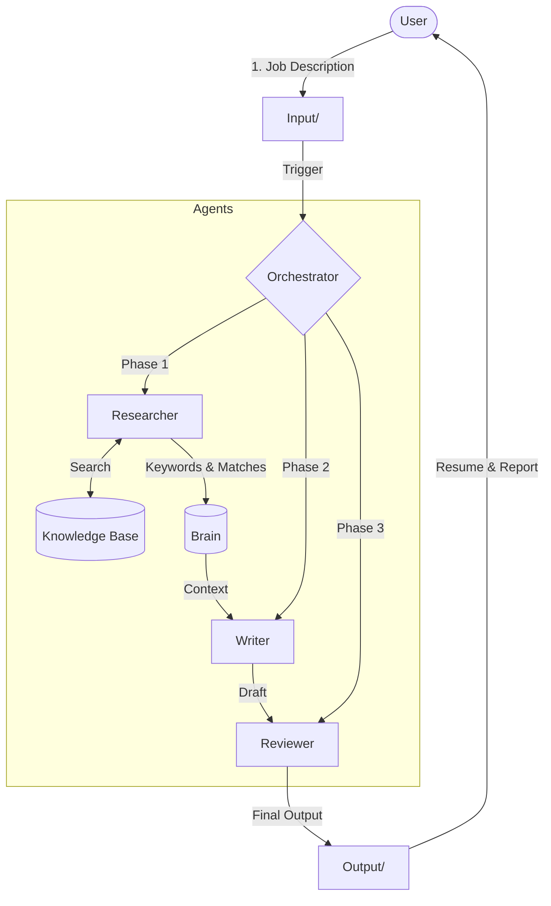

# Resume Writer Agent

An open-source, AI-driven workflow for generating ATS-optimized, expertly written resumes. This tool uses a multi-agent system (Researcher, Writer, Reviewer) to craft resumes that are tailored to specific job descriptions while staying true to your actual experience.

## Overview

Applying for jobs is tedious. Tailoring your resume for eveery single application is even worse. This tool automates the heavy lifting:

1.  **Orchestrator**: Manages the workflow and ensures quality gates are met.
2.  **Researcher**: Analyzes the Job Description, extracts ATS keywords, and finds matching evidence in your Knowledge Base.
3.  **Writer**: Drafts a compelling, formatted resume based on the research.
4.  **Reviewer**: Acts as a strict quality assurance step, checking for ATS compliance, factual accuracy, and fabrication risks.

## Getting Started

### 1. Prerequisites
-   An MCP-compatible agent environment (like Antigravity, or similar AI coding assistant).
-   Your career history documented.

### 2. Setup Your Knowledge Base
The system relies on a "Truth Source" to write your resume. It will **never** invent facts, only use what you provide.

1.  Navigate to the `/Knowledge Base` directory.
2.  **Important**: The files currently in there are **examples**. You should eventually remove them or set them aside.
3.  Create your own profile using `Knowledge Base/template.md`.
4.  Add as many markdown files as you like details your projects, case studies, metrics, and skills. The more detail, the better.

### 3. Usage
1.  **Input**: Place the job description you are applying for in `Input/Job-Description.md`.
2.  **Run**: Ask your AI Agent to "Run the Resume Workflow".
    -   *Prompt Example*: "Please run the resume workflow for the job description in Input/.'
3.  **Output**:
    -   Drafts and reports will appear in `/Output`.
    -   Research data (keywords, etc.) will appear in `/Brain`.

## Directory Structure
-   `Input/`: Where you put the Job Description.
-   `Knowledge Base/`: Your career data (Markdown/PDFs).
-   `Output/`: Generated resumes and review reports.
-   `Brain/`: Intermediate agent state and research data.
-   `.agent/`: Internal system prompts and workflows.

## License
[License Name/Type]
